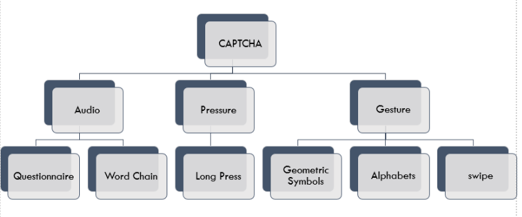
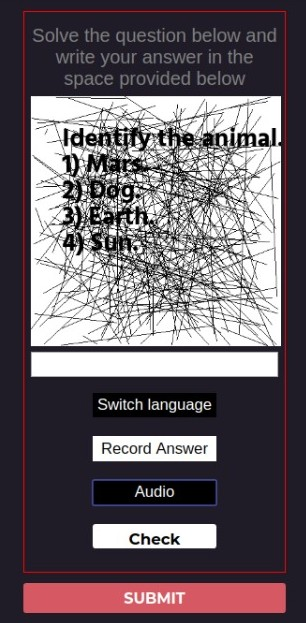
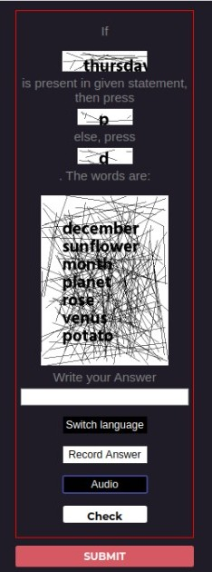
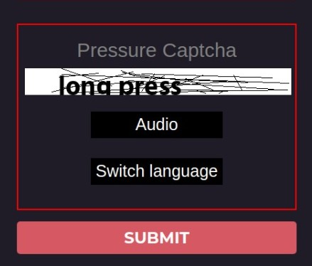
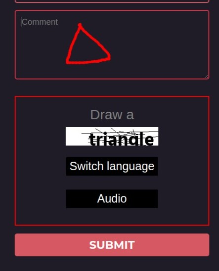
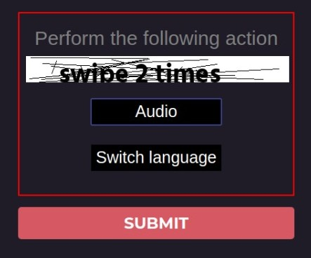
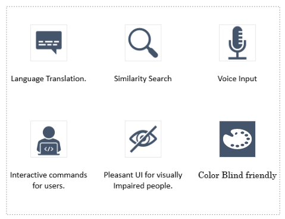

# 
 SIH 2020: Team Neoteric 

## Alternative Authentication Mechanism for Visually Impaired

### Ministry Category – DTE of IT and Cyber Security, DRDO 
### Problem Statement – CAPTCHA / Alternative Solution for Visually impaired 
### Problem Code – CK146

### Introduction: 
We are team Neoteric from College of engineering Pune and our problem statement is to propose alternative authentication mechanisms for visually impaired users.

### Defects with Current Captcha:
* Difficulty in figuring out letters and words, for the visually impaired and dyslexic
* Difficulty in understanding the audio due to accents, and similar background noise 

### Innovative features of our solution:
* ability to hear all questions
* ability to use speech to text to answer questions
* questions are chosen depending on users geographical area and language
* use of mechanisms which do not require humans to understand a specific language, or have profound knowledge 

### Types of Captcha:

#### Questionnaire:

 

We ask a simple question to the user, depending on his geographic location. The user needs to select the correct option and can either type the naswer in the box or speak out the answer, to have it typed out. 
This helps dyslexic and partially blind people who find it difficult to read captcha, but can easily solve these questions.

#### Word Chain:

We ask users to press a key if a certain chosen word is present in a set of further words, and another if it is not.
This is helpful for blind, less educated people as they do not need any previous knowledge to solve these questions

#### Pressure:

We ask users to press on the screen, and validate them using the the features of the press(time, intensity)
This captcha can be easily used by completely blind people, as there is no need to read and understand anything.

Currently, only long press pressure detection has been implemented, we plan to implement short press detection.

#### Symbol Recognition:

We ask users to draw on the screen, and use ML algorithms to check whether users have drawn the correct shape, to authenticate them.
This is helpful for blind, less educated people as they do not need any previous knowledge to solve these questions.

#### Character Recognition:

We ask users to draw letters on screen, and use ML algorithms to check whether users have drawn the correct shape, to authenticate them.
This is helpful for blind, less educated people as they do not need any previous knowledge to solve these questions.

#### Motion Recognition - Swipe:

We ask users to perform actions like swipe, pinch, tap etc.(Pinch, tap to be implemented).
This can be helpful for dyslexic and less blind people who find it difficult to see & understand complex instructions.

### Highlights of Our Solution

#### Targetted Users
* Visually impaired
* Colour Blind
* Dyslexic
* Completely Blind
* Regular Users 

#### Contributors:

### Code Structure:
/assets - contains assets of required for the project like fonts, audio, backgrounds etc

/backend - Contains the PHP and Python Backend Code

/audio_operation - php files for operations on the audio like getting the audio, translating the audio

/image_operation - php files for operations on the captch images like displaying the image, formatting the image. 

/validation - php files for validating the captcha. Files named as (captchaNomenclatureName)_(whatThisFileDoes).php

/captcha_pages - different php files which contain the pages for displaying the various captcha types. Files named as (captchaNomenclatureName).php

/examples - examples to view how the captchas work and look
